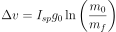
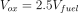
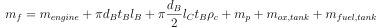
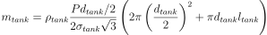

# Rocket Design Challenge

Basic conceptual rocket design and optimization using scipy minimize.

## Objective Function
**Ideal Rocket Equation**  
The following equation is the main objective function that is maximized. In order to use it with scipy minimize, a negative sign will be inserted to created the largest negative number possible.

<!-- ) -->

**Supplemental Equations**  
Additional equations are used to incorporate other components of the rocket design such as mass of additiona components, volume of fuel and fuel tanks, etc.

<!--   
  
  
^2%20+%20\pi%20\frac{d_{tank}}{2}%20l_{tank}%20\right))   -->

  
  
  
  
_Tank equation is used for calculating for the `ox` and `fuel` tanks_

The tank was chosen to a cylindrical tank to maximize the space usage within the rocket. Additionally there is a factor of `sqrt(3)` in the denominator that is an additional factor in reducing the required tank thickness.

## Parameters & Constants
| Parameter | Description |
| -- | -- |
| `V_fuel` | fuel volume (used to calculate `V_ox`) |
| `d_B` | body diameter |
| `l_B` | body length |
| `l_c` | fairing/cone length |
| `d_ox` | oxygen tank diameter |
| `l_ox` | oxygen tank length |
| `d_fuel` | kerosene tank diameter |
| `l_fuel` | kerosene tank length |  

| Constants | Value | Description |
| -- | -- | -- |
| `m_payload` | 10 | kg (payload mass) |
| `T` | 10000 | N (thrust) |
| `ratio_o2f` | 2.5 | (O2 to Fuel ratio - volume) |
| `Isp` | 250 | s (specific impulse)|
| `m_engine` | 15 | kg (engine mass)|
| `P_tank` | 2.5\*10**6 | Pa (tank pressure)|
| `rho_ox` | 1141 | kg/m^3 (density liquid O2)|
| `rho_fuel` | 810 | kg/m^3 (density kerosene)|
| `g` | 9.81 | m/s^2(gravity constant)|
| `t_b` | 2\*10**-3 | m (body thickness)|
| `rho_cone` | 1410 | kg/m^3 (cone shell density)|
| `rho_tank` | 1410 | kg/m^3 (tank density)|
| `sigma_tank` | 919\*10**6 | N/m^2 (tank yield strength)|

The density and yield strength are set as constants because if they are included in the optimization problem, the algorithm would push the parameters to the lowest possible density and the highest possible yield strength to minimize the weight of tanks.

In this case, the cone and tanks are assumed to be made of carbon fiber following the average spec values found [here](http://www.matweb.com/search/datasheet_print.aspx?matguid=39e40851fc164b6c9bda29d798bf3726).

## Constraints

## Optimized Results

## Additional Considerations
* Consider different shaped tanks such as spherical.
* For the tanks, the relationship between density and yield strength might be able to modeled in a formulaic relationship that more accurately represents the trade-off between density and structural strength.

## To Do
- [x] Write a simulation code to compute the mass of the rocket in its initial and final state as well as the expected delta-V of the rocket. The simulation may be coded in Python or MatLab.
- [ ] Using your simulation code please do the following:
   - [ ] Use numerical optimization to maximize the Delta-V produced by the rocket. Explain the formulation of your optimization problem, the approach you are using to solve it and the rationale for using your selected method.
   - [ ] Compute the gross take-off weight and burn time of your rocket and summarize the key design parameters in your optimization.
   - [ ] Assuming that the rocket is fired vertically, make an attempt to estimate the maximum height achieved by the rocket and the flight time to that point.
- [ ] Keep in mind this is a conceptual design, and as such the depth of your analysis can and should be kept at an appropriate level. You should briefly summarize what additional considerations would be included in your analysis for a more detailed case.
