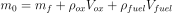

# Rocket Design Challenge

Basic conceptual rocket design and optimization using scipy minimize.

## Objective Function
**Ideal Rocket Equation**  
The following equation is the main objective function that is maximized. In order to use it with scipy minimize, a negative sign will be inserted to created the largest negative number possible.

<!-- ) -->


Additionally, the optimizer had difficulty optimizing a `ln` function because it requires gradients, and at large numbers the gradient for a natural log function may be very small. In this case, because `Isp` and `g` are constant, the optimization/minimization can be performed using:


**Supplemental Equations**  
Additional equations are used to incorporate other components of the rocket design such as mass of additiona components, volume of fuel and fuel tanks, etc.

<!--   
  
  
^2%20+%20\pi%20d_{tank}%20l_{tank}%20\right))   -->

  
  
  
  
_Tank equation is used for calculating for the `ox` and `fuel` tanks_

The tank was chosen to a cylindrical tank to maximize the space usage within the rocket. Additionally there is a factor of `sqrt(3)` in the denominator that is an additional factor in reducing the required tank thickness.

## Parameters & Constants
| Parameter | Description |
| -- | -- |
| `V_fuel` | fuel volume (used to calculate `V_ox`) |
| `d_B` | body diameter |
| `l_B` | body length |
| `l_c` | fairing/cone length |
| `d_ox` | oxygen tank diameter |
| `l_ox` | oxygen tank length |
| `d_fuel` | kerosene tank diameter |
| `l_fuel` | kerosene tank length |  

| Constants | Value | Description |
| -- | -- | -- |
| `m_payload` | 10 | kg (payload mass) |
| `T` | 10000 | N (thrust) |
| `ratio_o2f` | 2.5 | (O2 to Fuel ratio - volume) |
| `Isp` | 250 | s (specific impulse)|
| `m_engine` | 15 | kg (engine mass)|
| `P_tank` | 2.5\*10**6 | Pa (tank pressure)|
| `rho_ox` | 1141 | kg/m^3 (density liquid O2)|
| `rho_fuel` | 810 | kg/m^3 (density kerosene)|
| `g` | 9.81 | m/s^2(gravity constant)|
| `t_b` | 2\*10**-3 | m (body thickness)|
| `rho_cone` | 1410 | kg/m^3 (cone shell density)|
| `rho_tank` | 1410 | kg/m^3 (tank density)|
| `sigma_tank` | 919\*10**6 | N/m^2 (tank yield strength)|

The density and yield strength are set as constants because if they are included in the optimization problem, the algorithm would push the parameters to the lowest possible density and the highest possible yield strength to minimize the weight of tanks.

In this case, the cone and tanks are assumed to be made of carbon fiber following the average spec values found [here](http://www.matweb.com/search/datasheet_print.aspx?matguid=39e40851fc164b6c9bda29d798bf3726). Carbon fiber is a material with high yield strength and low density as compared to most metals; however, it can potentially be more difficult to manufacture well due to various factors such as the epoxy bonding structure, thread directions, imperfections, etc.

## Constraints
To match the constraints provided in the problem, and also the format needed to use scipy minimize the following constraint equations are used:

<!--   
  
^2%20l_{fuel,tank}%20-V_{fuel}%20-s%20\geq%200)  
^2%20l_{ox,tank}%20-V_{ox}%20-s%20\geq%200) -->

  
  
  
  

`s` is a variable to convert `>` to `>=` where `s >> 1`  
_(`s = 0.00001` is used in this case)_

**Components Fit Within Body Tube**  
The constraints to represent a constrained body are as follows:

<!--   
  
  
 -->

  
  


Relevant formula for tank thickness:  
  

These constraints contain place the tanks side by side to reduce the length of the rocket.
* Based on the provided formulas, the tank mass is primarily influenced by the radius. A smaller radius equates to a thinner tank wall. This will drive the optimizer to choose very long tanks to reduce the weight of the tank.
* If the tanks were stacked vertically, this generates an unreasonably tall rocket for a 10 kg payload.

**Other Bounds**  
All variables `>= 0`

## Optimization
The optimizer used in this case was the scipy minimize function to perform gradient-based optimization.
* Algorithm: `SLSQP` - used because it can incorporate constraints and bounds in the scipy minimize function. And from previous experience, it is fairly efficient at using fewer model evaluations.
* Jacobian/Gradients: `Finite Difference` - used the default for simplicity sake instead of implementing other methods or calculating by hand.
* Finite Difference Step: `1e-8`- reduce the FD step size to increase the accuracy of the FD.
* Convergence Tolerance: `0.02` - the default tolerance converges to a result that fails the constraints. However, a larger tolerance stops the optimization earlier with parameters that pass.

**Results**
```
Optimization terminated successfully    (Exit mode 0)
            Current function value: -13.196240405821255
            Iterations: 12
            Function evaluations: 90
            Gradient evaluations: 10
     fun: -13.196240405821255
     jac: array([-1.42305986e+02,  7.67048643e-03,  1.90780726e-03,  1.34500571e+00,
        1.37422340e+00,  1.15649713e-01,  7.64541142e-01,  5.81678709e-02])
 message: 'Optimization terminated successfully'
    nfev: 90
     nit: 12
    njev: 10
  status: 0
 success: True
       x: array([0.08570434, 0.64074261, 2.57612843, 0.        , 0.37458442,
       1.94459021, 0.26565541, 1.54661117])
----------------------------------------
Constraints Valid: [ True  True  True  True  True  True  True]
----------------------------------------
Delta-V: 6327.2831595721345 m/s
Take-off weight: 3331.7598555691807 N
Burn time: 76.98204739256785 s
Height at burnout: 119792.79691983071 m
Time to max height: 720.9650402133767 s
Max height: 2160282.9062626 m
```
Note:
* These results may not be correct because changing the convergence tolerance can cover up potential error - there is likely a modeling error due to incorrect assumptions or missing information.
* The model includes a parameter for the height of the fairing. As a result, the optimizer looks to reduce the weight, and because the fairing height is not tied to other parameters or constraints, it is reduced to zero.

**Design Parameters**

| Parameter | Value |
| -- | -- |
| Fuel Volume | 0.08570434 m^3|
| O2 Volume | 0.21426085 m^3|
| Body Diameter | 0.64074261 m|
| Body Length| 2.57612843 m|
| Fairing Length | 0 m|
| O2 Tank Diameter | 0.37458442 m|
| O2 Tank Length | 1.94459021 m|
| Fuel Tank Diameter | 0.26565541 m|
| Fuel Tank Length | 1.54661117 m|

## Considerations For Improvement
* Consider different shaped tanks such as spherical (to double check previous assumption)
* For the tanks, the relationship between density and yield strength might be able to modeled in a formulaic relationship that more accurately represents the trade-off between density and structural strength.
* Better jacobian/gradient calculation using imaginary step instead of other gradient calculation methods (finite difference, symbolic differentiation)
* Include structural modeling for the rocket to prevent the optimizer for selecting very tall structures.
* Add additional constraints for other components such as avionics, payload size, fairing size, etc
* Reduce the convergence tolerance (not sure how to do this, maybe there is a bug in my code)
* Write out code in an object oriented manner (useful for tracking convergence, parameter change, etc)

## Resources
* [Scipy Minimize Documentation](https://docs.scipy.org/doc/scipy/reference/generated/scipy.optimize.minimize.html)
* [Ideal Rocket Equation](https://www.grc.nasa.gov/WWW/K-12/rocket/rktpow.html)
* MDO Course notes
* [Burn time + Specific Impulse](https://www.grc.nasa.gov/www/k-12/airplane/specimp.html)
* [Burnout Height Calculation](https://web.mit.edu/16.unified/www/FALL/thermodynamics/notes/node103.html)
